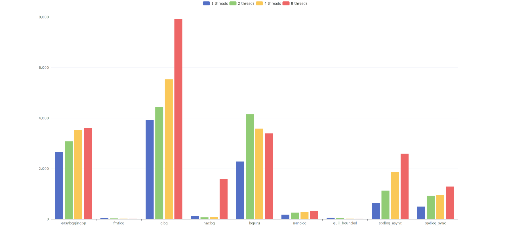
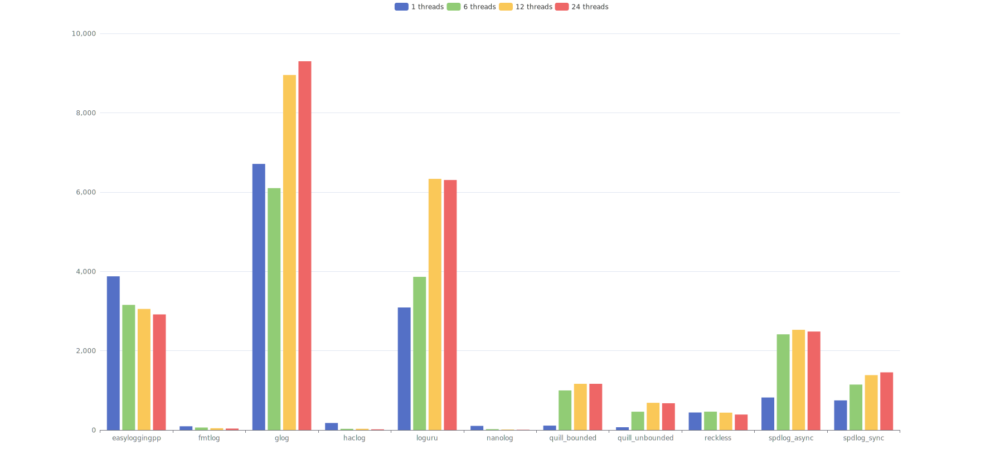

* [readme EN](./README.md)
* [readme 中文](./README_cn.md)

## 概述
此库对几个 C/C++ 日志库做 benchmark, 被测的库如下所示(按字母顺序排序)  
* [easyloggingpp](https://github.com/abumq/easyloggingpp): C++ logging library. It is extremely powerful, extendable, light-weight, fast performing, thread and type safe and consists of many built-in features. It provides ability to write logs in your own customized format. It also provide support for logging your classes, third-party libraries, STL and third-party containers etc.
* [fmtlog](https://github.com/MengRao/fmtlog): fmtlog is a performant fmtlib-style logging library with latency in nanoseconds.
* [glog](https://github.com/google/glog): C++ implementation of the Google logging module
* [haclog](https://github.com/MuggleWei/haclog): Haclog(Happy Aync C log) is an extremely fast plain C logging library
* [loguru](https://github.com/emilk/loguru): A lightweight C++ logging library
* [Nanolog](https://github.com/PlatformLab/Nanolog): Nanolog is an extremely performant nanosecond scale logging system for C++ that exposes a simple printf-like API. 
* [quill](https://github.com/odygrd/quill): Asynchronous Low Latency C++ Logging Library
* [reckless](https://github.com/mattiasflodin/reckless/tree/master): Reckless logging. Low-latency, high-throughput, asynchronous logging library for C++.
* [spdlog](https://github.com/gabime/spdlog): Fast C++ logging library

## Benchmark 说明
使用 google benchmark 进行测试, 测试分为两部分场景
1. **场景1**: 设定最小的测试时间 (设置 google benchmark 中的 MinTime), 在这时间中尽可能的压力测试写日志, 此场景主要针对异步日志, 可以反映日志库的吞吐量, 以及当缓冲区高度紧张的情况下日志前端的写入效率如何. 在此场景下测试的线程数量为: 1/2/4/8
2. **场景2**: 设定迭代和重复次数 (设置 google benchmark 中的 Iterations + Repetitions), 反映在非压力测试的情况下, 各个日志库的表现如何. 在此场景下测试的线程数量为: 1/${0.5 * CPU数量}/${1 * CPU数量}/${2 * CPU数量}  

## 构建
直接运行 `build.sh` (Windows 上运行 `build.bat`)进行构建, 构建过程中会自动下载被测的日志库. 接着运行 `run_benchmark.sh` 进行测试并生成报告, 生成的报告将在 `build` 目录下, 名为 `benchmark_*.txt`.  
注意: 由于部分日志库并不支持所有平台, 所以仅在 Linux 能够测试所有的日志库.  

## 基准测试
测试日期: 2023-10-14  
被测库版本, 详见: [CMakeLists.txt](./CMakeLists.txt)  
单次写入数据: 
```
struct LogMsg {
	uint64_t u64;
	uint32_t u32;
	int64_t i64;
	int32_t i32;
	char s[128];
};
```

日志输出格式:
```
${Level}|${datetime}|${filename}.${line_no}|${func_name}|${thread_id} - u64: msg.u64, i64: msg.i64, u32: msg.u32, i32: msg.i32, s: msg.s
```

### 测试机器
类型: 笔记本  
机器: 20R10002CD ThinkPad X1 Carbon 7th  
系统: Arch Linux x86_64  
Kernel: 6.5.6-arch2-1  
CPU: Intel i7-10710U (12) @ 4.700GHz  
GPU: Intel Comet Lake UHD Graphics  
Memory: 15659MiB  
gcc: (GCC) 13.2.1 20230801  
ldd: (GNU libc) 2.38  

### 额外说明
由于我本地机器的测试中遇到一些问题, 导致 fmtlog, quill 和 reckless 没有做到测试场景完全的覆盖
* 当 fmtlog 加入 `#define FMTLOG_BLOCK 1` 时, 测试进程会被卡死而无法继续, 所以 fmtlog 只测试了缓冲区满选择丢弃日志的模式
* 当 quill 使用 `UNBOUNDED` 时, 在 **场景1** 中, 会导致内存使用一直增长而失败, 所以在测试 quill_unbounded 的时候, 跳过 **场景1** 的测试
* reckless 在 **场景1** 中会卡住, 所以 reckless 跳过 **场景1** 的测试
* fmtlog 和 Nanolog 我并没有找到设置默认缓冲区的接口, 所以都只使用了默认的缓冲区大小

**由于个人水平所限, 若有错误和纰漏, 亦或是考虑欠妥之处, 还请不吝指正!**  

## 基准测试结果
在 [gbenchmark](./report/benchmark_20231014/gbenchmark) 目录中, 可以找到我本地机器的基准测试报告的详细信息, 图表化表示如下:  

**场景1**: 设定最小的测试时间 (x轴: 日志库+线程数, y轴: 写入耗时 (单位 ns))


**场景2**: 设定迭代和重复次数 (x轴: 日志库+线程数, y轴: 写入耗时(5次重复测试的中位数)(单位 ns))


## 结果分析
通过上述图表不难看出  
* 在场景 1 中, 较快的日志库有(按字母顺序排序): fmtlog, haclog, Nanolog, quill_bounded  
* 在场景 2 中, 较快的日志库为(按字母顺序排序): fmtlog, haclog, Nanolog  

**那么上面提到的这四个日志库为什么更快？他们有什么优劣势，以及使用中有什么要注意的坑呢？**  

以上 4 个日志库均为异步日志库, 设计上也都是多缓冲区队列写, 消费者负责轮询的模式, 整体思路相似, 代码细节各有各的趣味. 但作为用户来说, 有一点要特别注意  

**特别注意!!!**  
**特别注意!!!**  
**特别注意!!!**  

**既然都使用了缓冲区, 那么就一定要考虑缓冲区被写满的情况, 此时有三种不同的应对方式**
1. **阻塞**: 生产者线程阻塞, 等待缓冲区有足够空间后再写入
2. **丢弃**: 放弃写入本条日志, 或者直接套圈写入本条日志但是放弃一整个缓冲区的日志
3. **扩展**: 动态增加缓冲区的长度, 继续写入

haclog 与 Nanolog 选择了方案 1, fmtlog 可选方案 1/2, quill 可选方案 2/3  
而由于 [额外说明](#额外说明) 中提到的情况, 导致 fmtlog 只可选择方案 2, quill 在 **场景1** 中仅讨论 bounded 模式  

### fmtlog
优点
* 在两种场景下都表现出良好的速度, 其中在 **场景1** 中速度与 quill_bounded 旗鼓相当, 并列最快速度
* 在两种场景下, 速度表现的稳定性足够好, 波动较小
* 采用了 format 格式化风格

缺点
* 在 **场景1** 中出现了大量丢失日志的情况
* 在 **场景2** 中也出现了日志丢失的情况
* 设置 `#define FMTLOG_BLOCK 1` 情况时, 无法完成 **场景1** 的测试

### haclog
优点
* 在两种场景下大部分情况都表现出良好的速度, 其中 **场景2** 中多线程的情况下, 速度仅略逊于 Nanolog
* 缓冲区满时采用了阻塞模式, 不会丢日志

缺点
* 当吞吐量超过了某个阈值, 缓冲区大量被写满的情况下, 效率会出现大幅下跌

### Nanolog
优点
* 在两种场景下都表现出良好的速度, 其中在 **场景2** 中多线程的情况下, 速度排名第一
* 很高的吞吐量, 无论在 **场景1** 还是 **场景2** 中, 都没有出现效率大幅下跌的情况
* 缓冲区满时采用了阻塞模式, 不会丢日志

缺点
* 日志无法直接阅读, 需要使用附带的 decompressor 程序进行解码

### quill
优点
* 在 **场景1** 中速度与 fmtlog 旗鼓相当, 并列最快速度
* 采用了 format 格式化风格

缺点
* 在 bounded 模式下会出现日志丢失的情况
* 在 unbounded 模式下, 有可能导致内存一直增长, 无法完成 **场景1** 的测试

### 额外的一点考虑
haclog 使用纯 C 开发, 而 fmtlog, Nanolog 和 quill 采用 C++ 开发; 当就日志库这个场景来说, 理论上 C++ 实现速度上限会更高一点点, 表现为以下两个方面
* 编译期计算: C++ 能在编译期预计算好日志参数信息, 而纯 C 实现的日志库需要在第一次运行时计算
* 日志前端序列化:
  * C 需要在运行时遍历 va_list, 生成的汇编代码是通过循环来逐个参数序列化, 无论是通过 switch 判断预计算好的类型，或是调用预先设置好的函数指针, 都可能会带来一点额外的开销
  * C++ 通过变参模板来进行序列化, 汇编代码可实现为平铺展开的形式, 以空间换时间 

## 综上所述
* fmtlog 和 quill 采用 format 格式化风格, 书写方便, 且两者速度稳定性较强, fmtlog 和 quill_bounded 在 **场景1** 表现出色. 但是如上一小节所分析的, 他们的速度部分是通过日志丢失换取的, 这在使用场景上需要特别注意  
* haclog 在两种场景下也都表现出色, 在 **场景2** 中的表现仅略逊与 Nanolog, 但是在 **场景1** 当缓冲区被压满的情况下, 效率大幅度的降低. 这正好与 fmtlog 以及 quill 相反, 他以速度降低来换取了不丢日志  
* Nanolog 在两种场景下都表现出极高的效率, 以及超高的吞吐量. 在 **场景2** 下的王者, 在 **场景1** 中面临压力的情况下, 保证不丢日志也不用拿太多的效率去换. 不过其超高的吞吐量, 是拿日志非实时可读换取的, 这也导致诸如 `tail` 一类的工具无法使用

可以看出, 当前这几个异步日志并没有一个能在全方位碾压其他日志库, 而是都在某一方面做了权衡取舍  