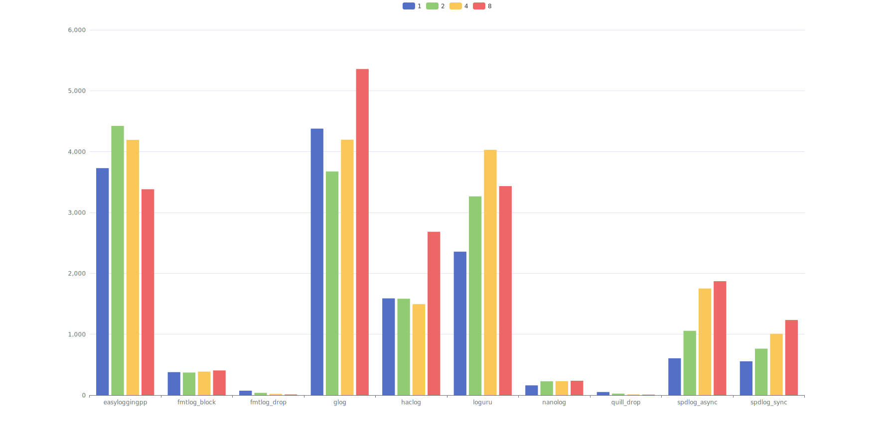

* [readme EN](./README.md)
* [readme 中文](./README_cn.md)

## 概述
此库对几个 C/C++ 日志库做 benchmark, 被测的库如下所示(按字母顺序排序)  
* [easyloggingpp](https://github.com/abumq/easyloggingpp): C++ logging library. It is extremely powerful, extendable, light-weight, fast performing, thread and type safe and consists of many built-in features. It provides ability to write logs in your own customized format. It also provide support for logging your classes, third-party libraries, STL and third-party containers etc.
* [fmtlog](https://github.com/MengRao/fmtlog): fmtlog is a performant fmtlib-style logging library with latency in nanoseconds.
* [glog](https://github.com/google/glog): C++ implementation of the Google logging module
* [haclog](https://github.com/MuggleWei/haclog): Haclog(Happy Aync C log) is an extremely fast plain C logging library
* [loguru](https://github.com/emilk/loguru): A lightweight C++ logging library
* [Nanolog](https://github.com/PlatformLab/Nanolog): Nanolog is an extremely performant nanosecond scale logging system for C++ that exposes a simple printf-like API. 
* [quill](https://github.com/odygrd/quill): Asynchronous Low Latency C++ Logging Library
* [reckless](https://github.com/mattiasflodin/reckless/tree/master): Reckless logging. Low-latency, high-throughput, asynchronous logging library for C++.
* [spdlog](https://github.com/gabime/spdlog): Fast C++ logging library

## Benchmark 说明
使用 google benchmark 进行测试, 测试分为两部分场景
1. **场景1**: 设定最小的测试时间 (设置 google benchmark 中的 MinTime), 在这时间中尽可能的压力测试写日志, 此场景主要针对异步日志, 可以反映日志库的吞吐量, 以及当缓冲区高度紧张的情况下日志前端的写入效率如何. 在此场景下测试的线程数量为: 1/2/4/8
2. **场景2**: 设定迭代和重复次数 (设置 google benchmark 中的 Iterations + Repetitions), 反映在非压力测试的情况下, 各个日志库的表现如何. 在此场景下测试的线程数量为: 1, 1/4n, 1/2n, n, 2n (此处的 n 为通过 `std::thread::hardware_concurrency` 获取硬件并行数量, 但是要注意, 此数量并不一定等于真实 CPU 核数，而且也会受到超线程的干扰)  

## 构建
直接运行 `build.sh` (Windows 上运行 `build.bat`)进行构建, 构建过程中会自动下载被测的日志库. 接着运行 `run_benchmark.sh` 进行测试并生成报告, 生成的报告将在 `build` 目录下, 名为 `benchmark_*.txt`.  
注意: 由于部分日志库并不支持所有平台, 所以仅在 Linux 能够测试所有的日志库.  

## 基准测试
测试日期: 2025-02-21  
被测库版本, 详见: [CMakeLists.txt](./CMakeLists.txt)  
单次写入数据: 
```
struct LogMsg {
	uint64_t u64;
	uint32_t u32;
	int64_t i64;
	int32_t i32;
	char s[128];
};
```

日志输出格式:
```
${Level}|${datetime}|${filename}.${line_no}|${func_name}|${thread_id} - u64: msg.u64, i64: msg.i64, u32: msg.u32, i32: msg.i32, s: msg.s
```

### 测试机器
类型: 笔记本  
机器: 20R10002CD ThinkPad X1 Carbon 7th  
系统: Arch Linux x86_64  
Kernel: 6.11.9-arch1-1  
CPU: Intel i7-10710U (12) @ 4.700GHz  
GPU: Intel Comet Lake UHD Graphics  
Memory: 15659MiB  
gcc: (GCC) 14.2.1 20240910  
ldd: (GNU libc) 2.40  

### CPU 频率设置与监控
执行 `cpupower frequency-info` 查看信息, 可以看到
```
analyzing CPU 7:
  driver: intel_pstate
  ...
  hardware limits: 400 MHz - 4.70 GHz
  ...
  boost state support:
    Supported: yes
    Active: yes
```

在开始测试之前, 运行 `scripts/set_cpu_freq.sh` 来将 CPU 频率限制在固定的值上(这里我选择了 3.2GHz). 而后, 当运行基准测试时, 运行 `scripts/monitor_cpu_freq.sh` 来监控 CPU 频率, 确认没有因 CPU 温度过高而降率.  

### 额外说明
由于我本地机器的测试中遇到一些问题, 导致 quill 和 reckless 没有做到测试场景完全的覆盖
* 由于希望日志写尽可能的快, 所以 quill 只测 `BOUNDED` 下的场景
* quill 在 **场景1** 中, `quill::QueueType::BoundedBlocking` 导致进程卡死, 所以此模式跳过 **场景1**  
* reckless 在 **场景1** 中会卡住, 所以 reckless 跳过 **场景1** 的测试
* Nanolog 我并没有找到设置默认缓冲区的接口, 所以都只使用了默认的缓冲区大小

**由于个人水平所限, 若有错误和纰漏, 亦或是考虑欠妥之处, 还请不吝指正!**  

## 基准测试结果
在 [benchmark](./report/benchmark_20250221/benchmark) 目录中, 可以找到我本地机器的基准测试报告的详细信息, 图表化表示如下:  

**场景1**: 设定最小的测试时间 (x轴: 日志库+线程数, y轴: google benchmark - Time)


**场景2**: 设定迭代和重复次数 (x轴: 日志库+线程数, y轴: google benchmark - Time)


### 关于 y 轴的值
y轴为 google benchmark - Time, 在多线程的情况下, 表示的并不是平均单次耗时, 而是按吞吐量和时间平均的结果. 具体公式为:  
**google benchmark Time = (sum(每个线程的耗时) ÷ 线程数量) ÷ 总执行次数**  
所以多线程的结果可进行横向对比, 但不可简单的认为是单次耗时. 若想得到多线程情况下的单次平均耗时数据, 可以修改 google benchmark (v1.8.3) 代码:  
```
// benchmark_runner.cc
BenchmarkRunner::IterationResults BenchmarkRunner::DoNIterations() {
  ...
  // 注释掉下面这行即可
  // i.results.real_time_used /= b.threads();
  ...
}
```

## 结果分析
通过上述图表不难看出  
* 在场景 1 中, 较快的日志库有(按字母顺序排序): fmtlog, Nanolog, quill
* 在场景 2 中, 较快的日志库为(按字母顺序排序): fmtlog, haclog, Nanolog, quill  

**那么上面提到的这四个日志库为什么更快？他们有什么优劣势, 以及使用中有什么要注意的坑呢？**  

以上 4 个日志库均为异步日志库, 设计上也都是多缓冲区队列写, 消费者负责轮询的模式, 整体思路相似, 代码细节各有各的趣味. 但作为用户来说, 有一点要特别注意  

**特别注意!!!**  
**特别注意!!!**  
**特别注意!!!**  

**既然都使用了缓冲区, 那么就一定要考虑缓冲区被写满的情况, 此时有三种不同的应对方式**
1. **阻塞**: 生产者线程阻塞, 等待缓冲区有足够空间后再写入
2. **丢弃**: 放弃写入本条日志, 或者直接套圈写入本条日志但是放弃一整个缓冲区的日志
3. **扩展**: 动态增加缓冲区的长度, 继续写入

haclog 与 Nanolog 选择了方案 1, fmtlog 可选方案 1/2, quill 可选方案 1/2/3  
而由于 [额外说明](#额外说明) 中提到的希望日志写尽可能的快, 所以 quill 仅讨论非扩展的模式  

### fmtlog
优点
* 在两种场景下都表现出良好的速度
* 若允许在缓冲区满时丢失日志, 则在 **场景1** 中速度与 `quill` 并列最快速度
* 支持缓冲区满时采用阻塞模式, 不会丢日志
* 采用了 format 格式化风格

缺点
* drop 模式下，在 **场景1** 中和 **场景2** 中均出现了丢失日志的情况

### haclog
优点
* 在 **场景2** 下表现出良好的速度
* 缓冲区满时采用了阻塞模式, 不会丢日志

缺点
* 当吞吐量超过了某个阈值, 缓冲区大量被写满的情况下, 效率会出现大幅下跌

### Nanolog
优点
* 在两种场景下都表现出良好的速度
* 很高的吞吐量, 在需要保证不丢日志的场景下, 无论是 **场景1** 还是 **场景2**, 都是绝对的王者
* 缓冲区满时采用了阻塞模式, 不会丢日志

缺点
* 日志无法直接阅读, 需要使用附带的 decompressor 程序进行解码
* 仅支持 Linux

### quill
优点
* 在两种场景下都表现出良好的速度,
* 若允许在缓冲区满时丢失日志, 其中在 **场景1** 中速度与 fmtlog 并列最快速度
* 在两种场景下, 速度表现的稳定性足够好, 波动较小
* 采用了 format 格式化风格
* 支持缓冲区满时采用阻塞模式, 不会丢日志

缺点
* 在 `quill::QueueType::BoundedDropping` 模式下会出现日志丢失的情况
* 在 `quill::QueueType::BoundedBlocking` 模式下, 无法完成 **场景1** 的测试

### 额外的一点考虑
haclog 使用纯 C 开发, 而 fmtlog, Nanolog 和 quill 采用 C++ 开发; 当就日志库这个场景来说, 理论上 C++ 实现速度上限会更高, 表现为以下两个方面
* 编译期计算: C++ 能在编译期预计算好日志参数信息, 而纯 C 实现的日志库需要在第一次运行时计算
* 日志前端序列化:
  * C 需要在运行时遍历 va_list, 生成的汇编代码是通过循环来逐个参数序列化, 无论是通过 switch 判断预计算好的类型, 或是调用预先设置好的函数指针, 都可能会带来额外的开销
  * C++ 通过变参模板来进行序列化, 汇编代码可实现为平铺展开的形式, 以空间换时间 

## 综上所述
* fmtlog 和 quill 采用 format 格式化风格, 书写方便
  * `fmtlog_drop` 和 `quill_bounded_dropping` 在 **场景1** 表现出色. 但是如上一小节所分析的, 此场景的速度部分是通过日志丢失换取的, 这在使用场景上需要特别注意
  * 两者也都支持缓冲区满时采用阻塞模式
* haclog 在 **场景2** 中的表现良好, 但是在 **场景1** 当缓冲区被压满的情况下, 可以保证不丢日志, 但是效率大幅度的降低  
* Nanolog 在两种场景下都表现出很高的效率以及超高的吞吐量, 面临压力的情况下, 保证不丢日志也不用拿太多的效率去换, 在不允许丢失日志的场景, Nanolog 在速度上是绝对的王者. 不过其超高的吞吐量, 是拿日志非实时可读换取的, 这也导致诸如 `tail` 一类的工具无法使用

可以看出, 当前这几个异步日志并没有一个能在全方位碾压其他日志库, 而是都在某一方面做了权衡取舍  